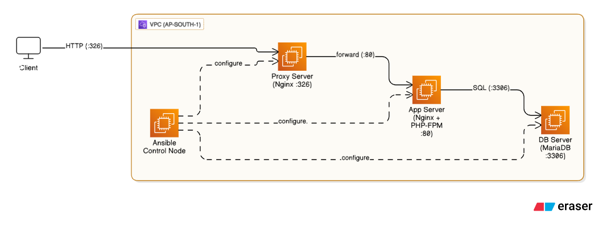
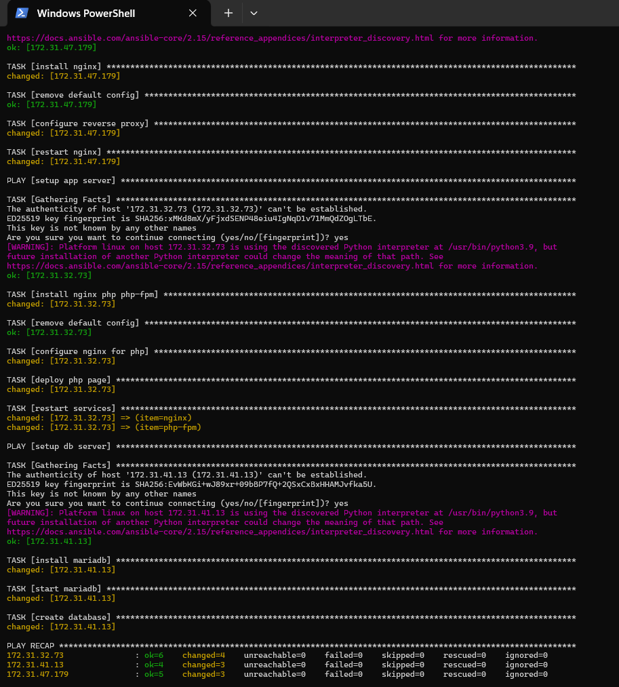
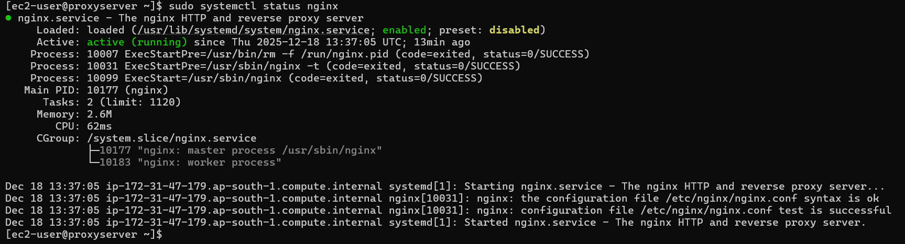
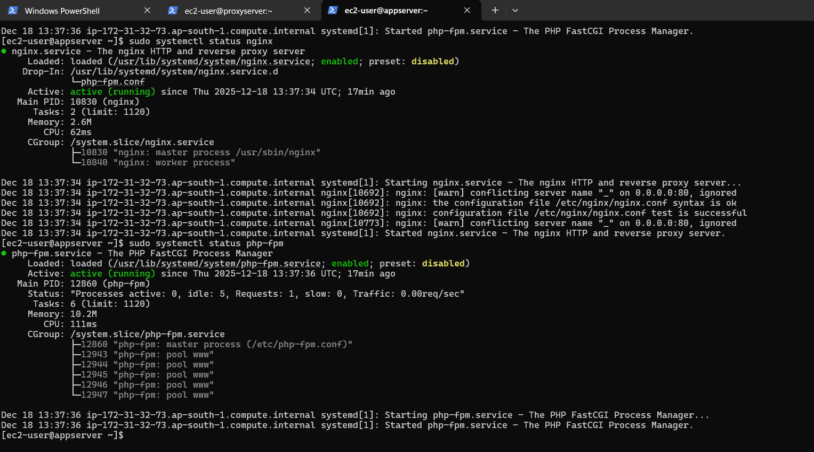
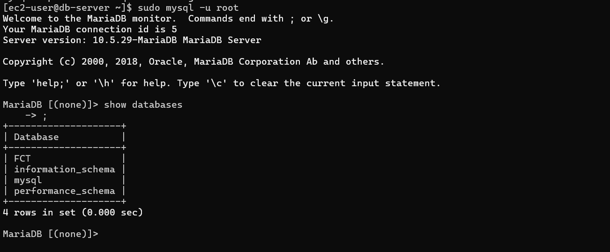
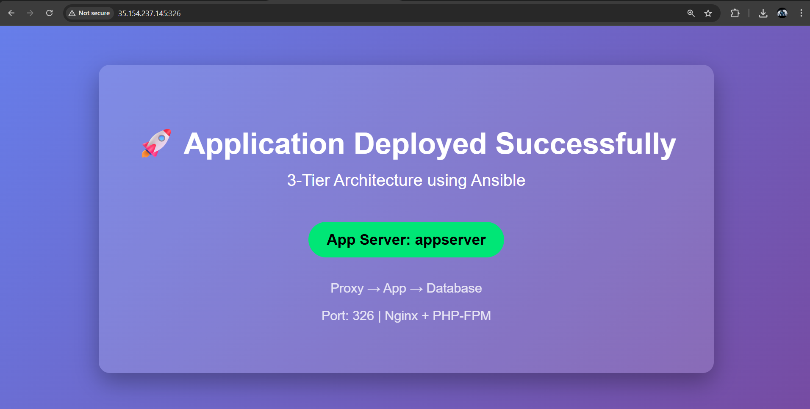
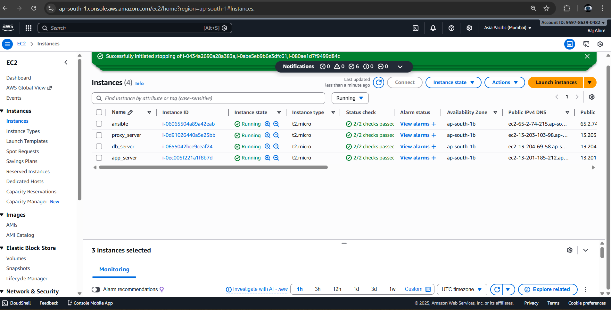

# AWS-3-Tier-Architecture-Provisioned-and-Configured-with-Ansible

This project demonstrates the deployment of a **3-Tier Architecture** on **AWS EC2 instances** using **Ansible automation**.
The setup includes a **Proxy Server**, an **Application Server**, and a **Database Server**, all provisioned and configured automatically using Ansible.

---

## Architecture Overview
The architecture follows a classic 3-tier design:



---

## Technology Stack

* **Cloud Platform:** AWS EC2 (Amazon Linux)
* **Automation Tool:** Ansible
* **Web Server:** Nginx
* **Application Runtime:** PHP + PHP-FPM
* **Database:** MariaDB
* **Architecture Type:** 3-Tier (Proxy → Application → Database)

---

## Project Structure

```
3-tier-ansible-project/
├── 3-tier.yml
├── inventory.ini
├── README.md
└── img/
    ├── architecture_overview.png
    ├── ansible_playbook_run.png
    ├── proxy_server_status_active.png
    ├── app_nginx_php_status.png
    ├── db_database_created.png
    ├── final_output_browser.png
    └── servers.png
```

---

## Inventory Configuration

The `inventory.ini` file defines the target servers:

```ini
[proxy_server]
172.31.47.179 ansible_user=ec2-user ansible_ssh_private_key_file=/home/ec2-user/com.pem

[app_server]
172.31.32.73 ansible_user=ec2-user ansible_ssh_private_key_file=/home/ec2-user/com.pem

[db_server]
172.31.41.13 ansible_user=ec2-user ansible_ssh_private_key_file=/home/ec2-user/com.pem
```

---

## Deployment Steps

### Clone the Repository

```bash
git clone https://github.com/RajAhire-1/AWS-3-Tier-Architecture-Provisioned-and-Configured-with-Ansible.git
cd AWS-3-Tier-Architecture-Provisioned-and-Configured-with-Ansible
```

### Update Inventory File

Update `inventory.ini` with your EC2 private IP addresses and SSH private key path.

### Run the Ansible Playbook

```bash
ansible-playbook -i inventory.ini 3-tier.yml
```

### Verify Services

* **Proxy Server:** Nginx running and listening on port `326`
* **Application Server:** Nginx and PHP-FPM running
* **Database Server:** MariaDB running with database created

### Access the Application

Open your browser and navigate to:

```
http://<proxy-server-public-ip>:326
```

---

## Screenshots

### Ansible Playbook Execution



### Proxy Server Nginx Status



### Application Server Nginx and PHP-FPM Status



### Database Server – Database Created



### Final Application Output in Browser



### AWS EC2 Instances Overview



---

## Validation Summary

* Reverse proxy configured on custom port **326**
* Traffic successfully forwarded from Proxy Server to Application Server
* PHP application executed correctly
* MariaDB installed and database created
* Complete infrastructure and configuration automated using Ansible

---

## Key Highlights

* End-to-end automation using Ansible
* No manual configuration on target servers
* Real-world DevOps architecture implementation
* Suitable for resumes, interviews, and portfolio projects

---
## Author & Links

* **LinkedIn:** [https://www.linkedin.com/in/raj-ahire](https://www.linkedin.com/in/raj-ahire)
* **Medium Blog:** [https://medium.com/@rajahire326](https://medium.com/@rajahire326)

